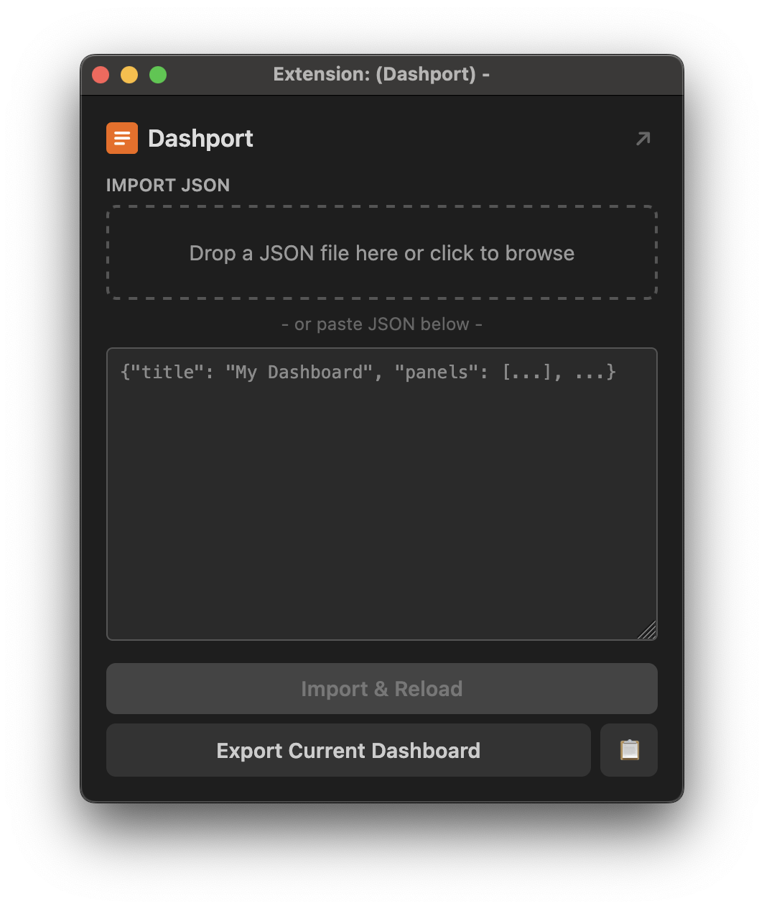

# Dashport

Dashport is a browser extension for Chrome and Firefox that lets you import and export Grafana dashboard JSON directly in the browser.



## Why?

Grafana lets you **export** a dashboard's JSON model, but there's no built-in way to **import** JSON back into an editing session. If you manage dashboards as code (e.g. deployed via Helm), this makes iterating painful: you can't save your work-in-progress to disk, close the browser, and pick up where you left off.

This extension adds that missing workflow:

1. **Export** a dashboard's JSON (download or copy to clipboard)
2. Edit the JSON, commit it, or just stash it for later
3. **Import** the JSON back into Grafana -- the page reloads with your modified dashboard ready to review and save

## How it works

The extension intercepts Grafana's internal API call (`GET /api/dashboards/uid/{uid}`) and replaces the response with your custom JSON when the page reloads.

- **Chrome** uses `declarativeNetRequest` to redirect the API call to a `data:` URI containing the merged JSON.
- **Firefox** uses `webRequest.filterResponseData()` to rewrite the response body in-flight.

Both approaches operate at the network layer, so there are no race conditions with Grafana's JavaScript.

## Install

### Chrome

1. Clone this repo and run `./build.sh`
2. Open `chrome://extensions/`
3. Enable **Developer mode**
4. Click **Load unpacked** and select `dist/chrome/`

### Firefox

1. Clone this repo and run `./build.sh`
2. Open `about:debugging#/runtime/this-firefox`
3. Click **Load Temporary Add-on...**
4. Select any file inside `dist/firefox/` (e.g. `manifest.json`)

> Temporary add-ons are removed when Firefox closes. For persistent installation, package as `.xpi` and sign via [Mozilla's Add-on Developer Hub](https://addons.mozilla.org/developers/).

## Usage

Navigate to a Grafana dashboard, then click the extension icon in the toolbar.

- **Export Current Dashboard** -- downloads the dashboard JSON as a file.
- **Copy to clipboard** (clipboard button) -- copies the JSON to your clipboard.
- **Import & Reload** -- upload a JSON file (drag-and-drop or file picker) or paste JSON into the text area, then click the button. The page reloads with your imported dashboard. Enter edit mode and save to persist.

The extension accepts both the raw dashboard model (`{"title": "...", "panels": [...]}`) and the full API response format (`{"meta": {...}, "dashboard": {...}}`).

## Project structure

```
src/                        Shared source for both browsers
  background.js             Import/export logic with browser feature detection
  popup.html / popup.js     Extension popup UI
  manifest.chrome.json      Chrome-specific manifest (MV3, declarativeNetRequest)
  manifest.firefox.json     Firefox-specific manifest (MV3, webRequestBlocking)
  icons/                    Extension icons
build.sh                    Builds dist/chrome/ and dist/firefox/
```

## Permissions

| Permission | Why |
|---|---|
| `activeTab` | Access the current tab to read/inject dashboard state |
| `scripting` | Run `executeScript` in the page context to read Grafana's scene model |
| `declarativeNetRequest` (Chrome) | Redirect the dashboard API call to a data URI |
| `webRequest` + `webRequestBlocking` + `webRequestFilterResponse` (Firefox) | Intercept and rewrite the dashboard API response body |
| `<all_urls>` (host) | Required because Grafana can be hosted on any domain |

## Limitations

- **Dashboard JSON size**: Chrome's `data:` URI redirect has a ~2 MB limit. Most dashboards are well under this.
- **Grafana Scenes only**: The export feature reads from `window.__grafanaSceneContext`, which requires Grafana 10+ with the Scenes framework. Import (API response replacement) should work with older versions too.
- **Single dashboard per reload**: The import rule is one-shot and auto-cleans after use.

## License

This project is dual-licensed under either of

- MIT license ([LICENSE-MIT](LICENSE-MIT) or <https://opensource.org/licenses/MIT>)
- Mozilla Public License, Version 2.0 ([LICENSE-MPL-2.0](LICENSE-MPL-2.0) or <https://www.mozilla.org/MPL/2.0/>)

at your option. `SPDX-License-Identifier: MIT OR MPL-2.0`

Unless you explicitly state otherwise, any contribution intentionally submitted for inclusion in this project by you shall be dual-licensed as above, without any additional terms or conditions.

> This is an unofficial, third-party extension and is not affiliated with or endorsed by Grafana Labs. "Grafana" is a trademark of Grafana Labs.
